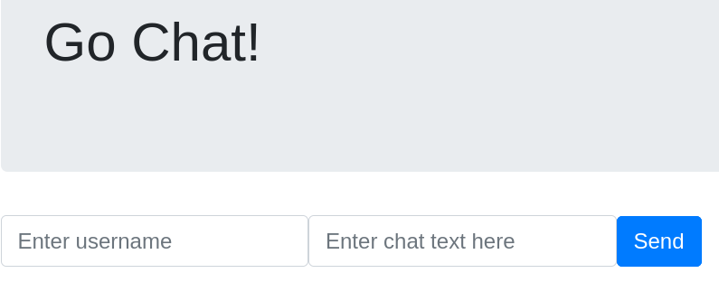
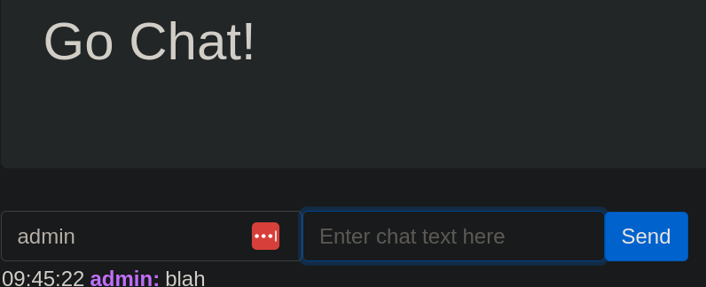

# junior-devops-assignment

This repo is made for assessing candidates for a Junior DevOps position at UNIwise.
If you are applying for this role we want you to complete the assignment described below.

We want to you to shine at the code-interview and for that reason the assignment is quite open-ended, however please focus on completing the requirements that are present.

We value quality over quantity, which to us means that you think about delivering working code before moving to other parts of the assignment and that the files you write are written readable and structured consistently.

## Assignment

### Part 1: required

This project contains a project that should be used with docker-compose, however it seems that there exists a few issues with starting it up!
You are tasked with:

1. Getting the project running containerized
    - you can test your solution with curl or a browser by visiting `http://localhost:<post>`
    - it should look like the website home: 
    - you can use docker or podman to build such a container image with `docker/podman build -t <image-name> .`
2. Getting the project running with all dependencies in docker-compose
    - it should be able to start up with `docker compose` or `podman-compose`
    - once it is working you should be able to create new chats using user `admin` on the frontpage and see them in the chat list, like this: 

### Part 2: optional

The following are optional tasks that you can choose to complete if you have time left:

- Create CI
    - choose any CI tool that you like, just either make images in your `handin.md` or provide access to us such that we can see for ourselves.
    - running `go build` is always a good start to make sure things are still building, adding tests would also make sense.
    - push the image to a registry
- Create unittests
- Consider how you could change the Dockerfile such that you can keep it minimal.
- Consider how you can introduce shifting left using linters or other tools.

### Handin

To hand in the assignment you should fork this repository and create a file `handin.md` in the root of the repository that contains:

1. Instructions of how to run the project
2. \[if any\] A section on what is missing/had issues solving
    - it is fine that required sections are missing, but please explain why and what you have tried to do.
3. \[if any\] Considerations on the assignment

You must add the people who your contact at UNIwise asks you to this project with a access level that allows the reviewers to see the things you have done.
This means that if you for example create CI on another platform you should also add us there.

Good luck and happy coding!
