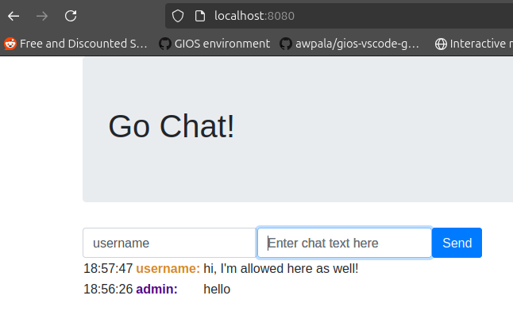

# Part 1: Required Tasks

## 1. Get the project running in containers

Two main commands are used:
```bash
docker build -t chat-app .
docker run -p 8080:80 chat-app
```

Initially, running them resulted in an error message:
```
2024/11/06 18:37:41 open .env: no such file or directory
panic: invalid redis URL scheme: 

goroutine 1 [running]:
main.main()
	/app/main.go:155 +0x399
```
It was caused by the following line in `main.go`:
```go
redisURL := os.Getenv("REDIS_URL")
```
which was trying to access the `REDIS_URL` environment variable. The solution was to include the default `REDIS_URL=redis://redis:6379` in the .env file, as well as copy this file into the container using the Dockerfile:
```Dockerfile
COPY .env /app
```
This solved the issue, and the page matched the reference page. Of course, trying to send any data on the website resulted in a an error:
```bash
2024/11/06 18:45:19 error: Key: 'ChatMessage.Text' Error:Field validation for 'Text' failed on the 'required' tag
```

## 2. Configure and run the project with all dependencies using Docker Compose

After setting environment variables in `.env` to the following:
```Dockerfile
HOST_PORT = 8080
PORT = 80 # container's port
REDIS_URL = redis://redis:6379
```
The `docker-compose.yml` was updated accordingly:
```yml
services:
  web:
    build: .
    ports:
      - "${HOST_PORT}:${PORT}"
    environment:
      - REDIS_URL=${REDIS_URL}

  redis:
    image: redis:latest
```
The redis service was added using the `redis:latest` image because the application relies on Redis.
Now, running the command `docker compose up` yielded a working solution.




# Part 2: Optional Tasks

## 1. Implement CI
To implement CI, Github Actions are used, and the implementation is present in `.github/workflows/go-ci.yml`. The `build-test` job pulls the code, sets up Go, grabs dependencies, builds the app, and runs the tests to make sure everything’s working. If it is, the `push_image` job logs into Docker Hub using repo's secrets, builds a Docker image, tags it as latest and with the commit SHA, then pushes it up to Docker Hub. 

For local GitHub Actions testing, `act` was used (https://github.com/nektos/act). Testing was as simple as calling `sudo ./bin/act push --secret-file my.secrets`.

Moreover, since no sensitive information is stored in `.env`, I decided to remove it from `.gitignore`. It helped me push the image to the registry using Github Actions. Any local secrets are stored in `my.secrets` instead. However, if `.env` grows to include sensitive data, other approach should be taken.

The Github actions succeeds after push, but a warning is generated regarding failing cache restoration. It is solved by adding `cache-dependency-path` property under `Go set up` step.